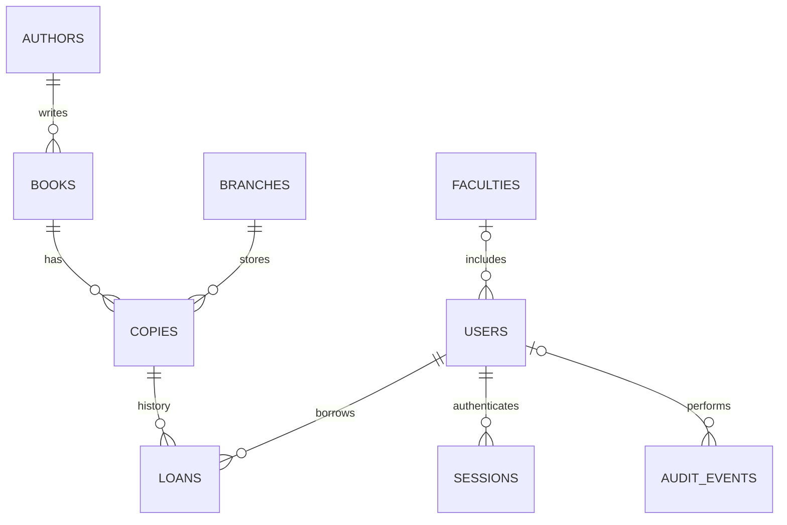

# Схема данных

Физическая схема находится в `schema.sql`. SQLite хранит данные в файле `DATABASE_PATH`. Для каждого подключения включены внешние ключи; применяется WAL и ожидание блокировки до 10 секунд. Автоматически создаётся отсутствующая схема, но изменение схемы существующей базы требует отдельной миграции.

| Таблица | Ключ и поля | Ограничения и связи |
|---|---|---|
| authors | id PK; name TEXT | Уникальное имя; API не принимает пустое |
| books | id PK; title TEXT; author_id FK; year INTEGER; isbn TEXT | author_id → authors; year 1450–2100; уникальный ISBN/шифр |
| branches | id PK; name TEXT; address TEXT | Уникальное имя |
| copies | id PK; book_id FK; branch_id FK; inventory_number TEXT | Ссылки на books и branches; уникальный инвентарный номер |
| faculties | id PK; name TEXT | Уникальное имя; длина 1–120 |
| users | id PK; username TEXT; password_hash TEXT; full_name TEXT; role TEXT; faculty_id FK NULL | Уникальный логин; role reader/librarian; ссылка на faculties; читателю API требует факультет |
| loans | id PK; copy_id FK; reader_id FK; issued_at TEXT; due_at TEXT; returned_at TEXT NULL | Ссылки на copies/users; даты ISO; срок и возврат не раньше выдачи |
| sessions | token_hash PK TEXT; user_id FK; csrf_token TEXT; expires_at INTEGER | SHA-256 случайного токена, ссылка на users; срок Unix time |
| audit_events | id PK; actor_id FK NULL; action TEXT; entity TEXT; entity_id INTEGER; created_at TEXT | Ссылка actor_id на users; entity_id логический, чтобы сохранять события удаления |

Все поля обязательны, кроме явно помеченных NULL. `id` — INTEGER PRIMARY KEY. Обязательность `NOT NULL` и точные SQL-ограничения заданы в `schema.sql`. Длины большинства строк и роль пользователя при выдаче проверяются на уровне API; они не являются отдельными SQL CHECK.

Книга — описание издания, экземпляр — отдельная физическая единица. Отношение книга–экземпляры равно 1:N, поэтому одну книгу можно одновременно выдавать разным читателям, если используются разные экземпляры. Статус экземпляра не дублируется в таблице: отсутствие активной выдачи означает наличие в фонде.

Частичный уникальный индекс `one_active_loan_per_copy` построен на `loans(copy_id) WHERE returned_at IS NULL`. Он разрешает историю нескольких выдач и запрещает две активные выдачи одного экземпляра. Операция выдачи выполняется в `BEGIN IMMEDIATE`: проверка лимита, просрочек, доступности, вставка выдачи и запись аудита составляют одну транзакцию. При ошибке изменения откатываются.

Индексы `loans_reader(reader_id,returned_at)`, `copies_book(book_id,branch_id)` и `books_author(author_id)` обслуживают связанные запросы. Каскадного удаления нет: используемые справочники и экземпляры с историей защищены внешними ключами. Отчёты строятся запросами COUNT и GROUP BY, без хранения дублирующих итогов.
